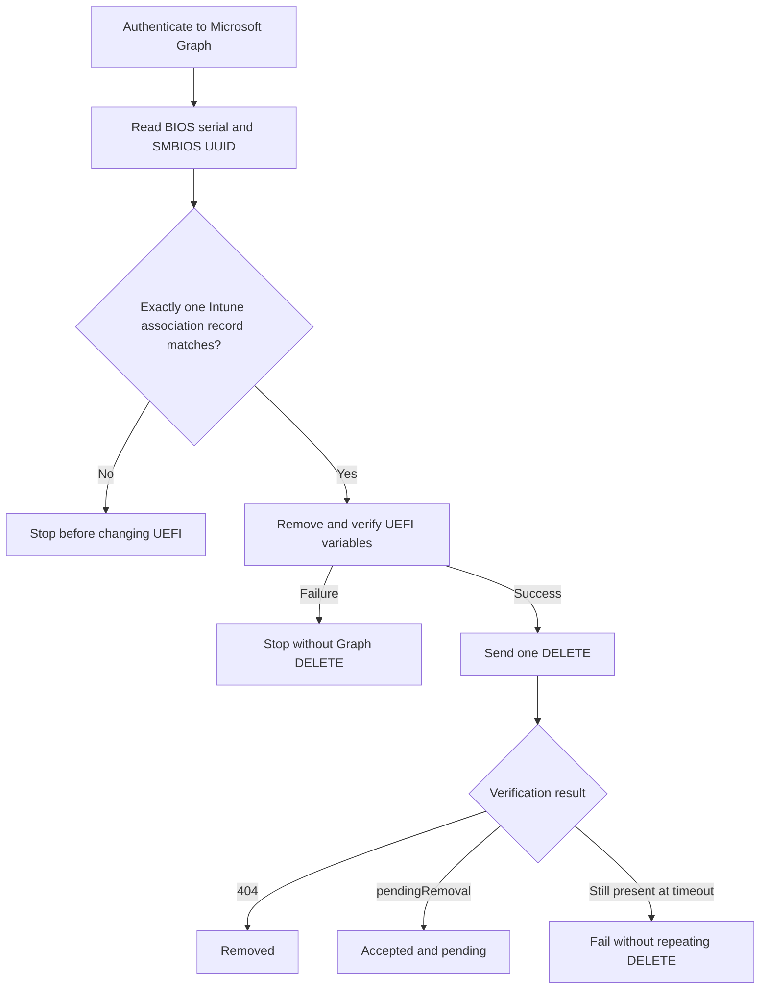

# Windows Autopilot Device Association toolkit

`Get-AutopilotDeviceAssociation.ps1` is a PowerShell toolkit for exporting, inspecting, importing, applying, reading and removing a Windows Autopilot Device Association.

It brings the device-side and Intune-side parts of the lab workflow into one script. You can use it to export the genuine TPM-backed DeviceLink identity package produced by Windows, import that package into Intune, follow the association to the device, inspect its local UEFI markers and collect redacted evidence when something fails.

The technical background and complete 12-step flow are explained in the Patch My PC article:

**[Windows Autopilot Device Association: the complete 12-step flow](https://patchmypc.com/blog/windows-autopilot-device-association/)**

Installing from the PowerShell Gallery? Start with [GALLERY.md](./GALLERY.md).

> [!IMPORTANT]
> This is a diagnostic and lab toolkit. It calls Windows DeviceLink interfaces and Microsoft Graph beta endpoints that can change. Test it before using it in an operational workflow. Removing an association changes UEFI state and, by default, also deletes the Intune Device Association record.

## Contents

- [What the script can do](#what-the-script-can-do)
- [How Device Association works](#how-device-association-works)
- [Requirements](#requirements)
- [Download and preparation](#download-and-preparation)
- [Authentication and policy selection](#authentication-and-policy-selection)
- [Quick start](#quick-start)
- [Actions](#actions)
- [Parameters](#parameters)
- [Inspecting a DeviceLink CSV](#inspecting-a-devicelink-csv)
- [Reading and removing the UEFI association](#reading-and-removing-the-uefi-association)
- [Removing the Intune Device Association record](#removing-the-intune-device-association-record)
- [Logging and evidence](#logging-and-evidence)
- [Troubleshooting](#troubleshooting)
- [Security and behavior boundaries](#security-and-behavior-boundaries)
- [Validation](#validation)
- [References](#references)

## What the script can do

| Capability | What it does |
|---|---|
| Export | Asks the Windows DeviceLink API to create a genuine `*.devicelink.csv` containing the device's TPM-backed identity package. |
| Inspect | Decodes the CSV and reports device inventory, signing metadata, the declared RSA-PSS salt length and the salt length recovered from the signature structure. |
| Upload | Sends the unchanged CSV `Data` value and selected Device Preparation policy to Intune through Microsoft Graph. |
| Wait | Polls the imported record until it reaches `preassociated` or `associated`. |
| Discover | Asks the native Windows DeviceLink manager to discover the tenant's enrollment service. |
| Link | Runs native discovery and asks Windows to obtain and apply the tenant-signed DeviceLink association. |
| Read association | Reports the presence, length, attributes and SHA-256 of known Device Link UEFI variables without returning their contents. |
| Remove local association | Deletes and verifies the known Device Link UEFI variables. |
| Remove cloud association | Optionally resolves and deletes the matching Intune Device Association record after local UEFI removal succeeds. |
| Diagnose | Creates numbered steps, safe verbose events and one redacted diagnostic artifact for every REST request. |

The script does not generate a replacement identity, change the RSA-PSS salt, re-sign a CSV or turn a virtual machine into supported Device Association hardware. The exported `Data` value is preserved exactly for upload.

## How Device Association works

Device Association gives Windows a trusted tenant relationship before a user signs in. That relationship can then be used to request current OOBE settings for the device. Association, policy retrieval, Entra join and Intune enrollment are separate operations.

```mermaid
flowchart LR
    A[Windows in OOBE] -->|Export genuine identity| B[DeviceLink CSV]
    B -->|Import unchanged Data value| C[Intune Device Association]
    C -->|Pre-associated| D[Windows discovery]
    D --> E[TPM and attestation]
    E --> F[Tenant-signed DeviceLink]
    F -->|Store locally| G[UEFI association]
    G --> H[Tenant-aware OOBE policy request]
    H --> I[User sign-in, Entra join and Intune enrollment]
```



The script covers the export, inspection, import, wait, discovery, association and local evidence shown above. It does not replace the OOBE UI and does not enroll the computer by itself.

The native `Link` operation can include traffic for discovery, TPM or Azure Attestation, DeviceLink download and acknowledgement. That traffic belongs to Windows, not PowerShell, so it is outside the script's REST logger.

## Requirements

The exact requirements can change as Microsoft updates Device Association. Check Microsoft's current documentation before testing.

For the complete device-side flow, expect to need:

- Supported physical Windows 11 hardware with a healthy, enabled TPM 2.0.
- A Windows build and updates that support Autopilot Device Association.
- An elevated 64-bit PowerShell session, or a SYSTEM context where appropriate.
- Internet access to Microsoft identity, Graph, Intune enrollment and attestation services.
- An Intune tenant configured for Windows Autopilot Device Preparation.
- A Microsoft Entra application with administrator-consented Microsoft Graph application access for the Graph operations used in your tenant.
- A Device Preparation policy when importing a new Device Association record.

The script has been parsed and tested with Windows PowerShell 5.1 and PowerShell 7.6. The tests use local Graph and firmware substitutes; they do not prove that every Windows build or tenant exposes the same beta behavior.

`Inspect` can run without elevation or Graph access. `ReadAssociation` and local removal need access to UEFI variables and therefore must run elevated. Export and native association are intended for the supported Windows OOBE scenario.

## Download and preparation

Place [`Get-AutopilotDeviceAssociation.ps1`](./Get-AutopilotDeviceAssociation.ps1) in a working folder on the test device. If Windows marked the downloaded file as coming from the internet, review it and unblock it:

```powershell
Unblock-File -Path .\Get-AutopilotDeviceAssociation.ps1
```

Open an elevated PowerShell session and view the built-in help:

```powershell
Get-Help .\Get-AutopilotDeviceAssociation.ps1 -Detailed
```

By default, exported files are written below:

```text
C:\ProgramData\DeviceLink
```

Each run writes its diagnostic files to a separate subdirectory below:

```text
C:\ProgramData\DeviceLink\Logs
```

Use `-WorkFolder` and `-LogFolder` to change those locations.

## Authentication and policy selection

Graph actions use application credentials. Certificate authentication is preferred because it avoids placing a client secret in the command line and PowerShell history.

The certificate must be available with its private key in either:

```text
Cert:\CurrentUser\My
Cert:\LocalMachine\My
```

Example certificate parameters:

```powershell
-TenantId '<tenant-guid>' `
-ClientId '<application-guid>' `
-CertificateThumbprint '<certificate-thumbprint>'
```

Client-secret authentication is also supported:

```powershell
-TenantId '<tenant-guid>' `
-ClientId '<application-guid>' `
-ClientSecret '<client-secret>'
```

> [!CAUTION]
> Redaction protects the script's diagnostic files, but it cannot remove a secret from your interactive command history, process inspection tools or external transcripts. Prefer a certificate and never commit secrets to a repository.

### Microsoft Graph application permissions

The app registration used for the working lab had these **Microsoft Graph application permissions**:

| Application permission | Used by the toolkit for |
|---|---|
| `DeviceManagementConfiguration.Read.All` | Reading the available Device Preparation policies when the script needs to resolve a policy. |
| `DeviceManagementConfiguration.ReadWrite.All` | The working lab's read/write access to Intune device-configuration operations. |
| `DeviceManagementServiceConfig.Read.All` | Reading Device Association records and their state. |
| `DeviceManagementServiceConfig.ReadWrite.All` | Importing and deleting Device Association records. |

Add them under **App registrations > API permissions > Add a permission > Microsoft Graph > Application permissions**, then select **Grant admin consent** for the tenant. Delegated permissions are not used because the script obtains an app-only token through the OAuth client-credentials flow.

> [!NOTE]
> This is the permission set confirmed in the lab, rather than a claim that all four grants form the least-privileged set. The corresponding `ReadWrite.All` permissions normally overlap read access, but the beta `tenantAssociatedDevices` and `importTenantAssociatedDevice` operations do not currently have a public Microsoft Graph permission table that lets us prove a smaller combination. Test reduced permissions separately before relying on them.

When an import needs a Device Preparation policy, use one of these selection methods:

| Parameter | Selection behavior |
|---|---|
| `-DevicePreparationPolicyId` | Uses the supplied policy ID directly. This is the most deterministic option. |
| `-PolicyName` | Lists applicable policies and selects an exact name match. |
| `-FirstPolicy` | Uses the first applicable policy returned by Graph. Use this only in a controlled lab. |

If no selection resolves to a policy, the script displays the policies it found and stops before import.

## Quick start

### Inspect an existing CSV without changing it

```powershell
.\Get-AutopilotDeviceAssociation.ps1 -Action Inspect `
  -CsvPath 'C:\Temp\PC1.devicelink.csv' `
  -Verbose
```

### Export a genuine DeviceLink CSV

Run this in the supported Windows/OOBE context:

```powershell
.\Get-AutopilotDeviceAssociation.ps1 -Action Export -Verbose
```

The script prints the complete path of the exported CSV.

### Upload an existing CSV

```powershell
.\Get-AutopilotDeviceAssociation.ps1 -Action Upload `
  -CsvPath 'C:\Temp\PC1.devicelink.csv' `
  -TenantId '<tenant-guid>' `
  -ClientId '<application-guid>' `
  -CertificateThumbprint '<certificate-thumbprint>' `
  -DevicePreparationPolicyId '<policy-guid>' `
  -Verbose
```

Upload has no automatic POST retry. If the service response is uncertain, review the HTTP diagnostic artifact and Intune before sending the import again.

### Export and upload, but do not apply the association locally

```powershell
.\Get-AutopilotDeviceAssociation.ps1 -Action Sync `
  -TenantId '<tenant-guid>' `
  -ClientId '<application-guid>' `
  -CertificateThumbprint '<certificate-thumbprint>' `
  -DevicePreparationPolicyId '<policy-guid>' `
  -Verbose
```

`Sync` exports the CSV, uploads it and waits for the Intune record to become pre-associated. It does not run the native local association step.

### Run the complete lab pipeline

```powershell
.\Get-AutopilotDeviceAssociation.ps1 -Action Full `
  -TenantId '<tenant-guid>' `
  -ClientId '<application-guid>' `
  -CertificateThumbprint '<certificate-thumbprint>' `
  -DevicePreparationPolicyId '<policy-guid>' `
  -Verbose
```

`Full` performs export, inspection, import, waits for pre-association, then invokes native Windows discovery and association.

### Discover without applying the association

```powershell
.\Get-AutopilotDeviceAssociation.ps1 -Action Discover `
  -CsvPath 'C:\Temp\PC1.devicelink.csv' `
  -Verbose
```

### Discover and apply the association

```powershell
.\Get-AutopilotDeviceAssociation.ps1 -Action Link `
  -CsvPath 'C:\Temp\PC1.devicelink.csv' `
  -Verbose
```

### Check whether this device qualifies

```powershell
.\Get-AutopilotDeviceAssociation.ps1 -Action CheckRequirements -Online
```

Verifies the [documented requirements](https://learn.microsoft.com/autopilot/device-preparation/device-association/requirements): a physical device, Windows 11 24H2 `26100.9278` or 25H2 `26200.9278` (KB5120998 or later), a supported edition, TPM 2.0 enabled and not in Reduced Functionality Mode, UEFI firmware, and with `-Online` the required Microsoft endpoints. The device-side actions run the same check as a non-blocking preflight.

### Read the local UEFI markers

```powershell
.\Get-AutopilotDeviceAssociation.ps1 -Action ReadAssociation -Verbose
```

### Check whether the association token is valid

```powershell
.\Get-AutopilotDeviceAssociation.ps1 -Action ReadAssociation -Validate -Online -TenantId '<tenant-guid>' -Verbose
```

`-Validate` decodes `DeviceLinkJwtCompressed` and checks it is a well-formed RS256 JWT inside its `iat`/`exp` window, with a `linkId` matching the `DeviceLinkId` UEFI variable and matching tenant/device claims. `-Online` also verifies the RS256 signature against the issuer's published key. Booleans, timestamps and the signing-key thumbprint only; never the token or claim values — unless you add `-ShowClaims`, which prints the decoded header and payload to the console (never to the diagnostic files).

### Preview local removal

```powershell
.\Get-AutopilotDeviceAssociation.ps1 -Action RemoveAssociation -WhatIf -Verbose
```

### Remove only the local UEFI association (keep the Intune record)

```powershell
.\Get-AutopilotDeviceAssociation.ps1 -Action RemoveAssociation -Verbose
```

### Preview local and Intune Device Association removal

The online `-WhatIf` run performs authentication and the read-only cloud lookup, but it does not change UEFI or send DELETE:

```powershell
.\Get-AutopilotDeviceAssociation.ps1 -Action RemoveAssociation `
  -TenantId '<tenant-guid>' `
  -ClientId '<application-guid>' `
  -CertificateThumbprint '<certificate-thumbprint>' `
  -WhatIf -Verbose
```

### Remove the local and Intune Device Association

```powershell
.\Get-AutopilotDeviceAssociation.ps1 -Action RemoveAssociation `
  -TenantId '<tenant-guid>' `
  -ClientId '<application-guid>' `
  -CertificateThumbprint '<certificate-thumbprint>' `
  -Verbose
```

## Actions

Every action prints its plan before starting and reports progress as `[STEP current/total]`.

| Action | Steps | Network | Changes state |
|---|---:|---|---|
| `Inspect` | 1 | No | No; reads and decodes the selected CSV. |
| `Export` | 2 | Native Windows behavior | Creates a CSV, then inspects it. |
| `Upload` | 3 | Microsoft identity and Graph | Imports the supplied identity and polls its association state. |
| `Sync` | 4 | Native Windows behavior, Microsoft identity and Graph | Exports, imports and waits for pre-association. |
| `Discover` | 2 | Native Windows DeviceLink traffic | Requests tenant discovery without applying the association. |
| `Link` | 2 | Native Windows DeviceLink traffic | Discovers and applies the association. |
| `Full` | 5 | Native Windows behavior, Microsoft identity and Graph | Exports, imports, waits, discovers and applies. |
| `CheckRequirements` | 1 | No (or endpoint tests with `-Online`) | No; verifies the documented Device Association requirements. |
| `ReadAssociation` | 1 | No | No; reads metadata about known UEFI variables. |
| `ReadAssociation -Validate` | 2 | Optional (`-Online`: issuer JWKS, anonymous) | No; decodes and checks the `DeviceLinkJwtCompressed` token, optionally verifying its RS256 signature. |
| `RemoveAssociation` | 4 | Microsoft identity and Graph | Deletes the local UEFI variables **and** the matching Intune record. |
| `RemoveAssociation -KeepCloudAssociation` | 1 | No | Deletes and verifies only the known local UEFI variables. |
| `RemoveAssociation -DeleteCloudAssociation` | 4 | Microsoft identity and Graph | Resolves the cloud record, removes UEFI, sends one Graph DELETE and verifies the cloud result. |

`Action` defaults to `Full`. For safety, choose the action explicitly in scripts and administrative procedures.

## Parameters

| Parameter | Purpose | Default |
|---|---|---|
| `-Action` | Selects `Full`, `Sync`, `Export`, `Inspect`, `Upload`, `Discover`, `Link`, `ReadAssociation`, `RemoveAssociation` or `CheckRequirements`. | `Full` |
| `-CsvPath` | Path to an existing `*.devicelink.csv`. | Newest CSV in `WorkFolder` where supported by the action. |
| `-DeviceLinkBase64` | Supplies the CSV `Data` value directly. | None |
| `-WorkFolder` | Stores exports and supplies the default CSV search location. | `C:\ProgramData\DeviceLink` |
| `-Format` | Windows DeviceLink export format flags. `33` means JSON plus Base64. | `33` |
| `-TimeoutSec` | Native-operation and polling timeout. | `300` seconds |
| `-HttpTimeoutSec` | Timeout for each PowerShell REST request. | `180` seconds |
| `-LogFolder` | Parent folder for per-run diagnostic folders. | `<WorkFolder>\Logs` |
| `-TenantId` | Microsoft Entra tenant ID for app-only Graph authentication. | None |
| `-ClientId` | Microsoft Entra application ID. | None |
| `-ClientSecret` | Application secret. Prefer certificate authentication. | None |
| `-CertificateThumbprint` | Thumbprint of a certificate with an accessible private key. | None |
| `-DevicePreparationPolicyId` | Exact Device Preparation policy ID for import. | None |
| `-PolicyName` | Exact Device Preparation policy name to resolve. | None |
| `-FirstPolicy` | Selects the first applicable policy returned by Graph. | Disabled |
| `-KeepCloudAssociation` | With `RemoveAssociation`: clear UEFI only and leave the Intune record. Alias `-LocalOnly`. | Disabled (the record is removed) |
| `-TenantAssociatedDeviceId` | Optional exact Device Association record GUID. The record must still match the local serial number or SMBIOS UUID. | Automatic matching |
| `-Validate` | With `ReadAssociation`: decode and check the `DeviceLinkJwtCompressed` token (structure, `iat`/`exp` window, `linkId`/tenant/device-binding claims). Add `-Online` to verify its RS256 signature against the issuer's published key. | Disabled |
| `-ShowClaims` | With `-Validate`: also print the decoded JOSE header and payload claims to the console (never to the diagnostic files). | Disabled |
| `-GraphBase` | Microsoft Graph base URL. Mainly useful for testing. | `https://graph.microsoft.com/beta` |
| `-Verbose` | Shows safe decision, timing and substep details and saves them in the logs. | Disabled |
| `-WhatIf` | Previews guarded removal operations. Online preview still performs authentication and read-only matching. | Disabled |

## Inspecting a DeviceLink CSV

The CSV contains a Base64-encoded JSON identity package. It includes device inventory, the DeviceLink identifier, public-key information and a signature produced with the device's TPM-backed identity key.

`Inspect` performs these checks without changing the file:

1. Detects common UTF-8 and UTF-16 encodings.
2. Requires one CSV row with a nonempty `Data` field.
3. Decodes the Base64 value into JSON.
4. Locates the public key named by `DeviceInfoSigningKeyName`.
5. Reads the RSA-PSS encoded signature structure.
6. Compares the recovered salt length with `DeviceInfoSignaturePssSaltLength`.

Example output:

```text
SigningKey              : IDK_1
Algorithm               : RSA2048-SHA256
PssTrailer_0xBC         : True
SaltLength_claimed      : 222
SaltLength_inSignature  : 222
FieldMatchesSignature   : True
ValidationScope         : Salt structure only; the inventory message digest has not been verified.
```

A salt length of `222` is not automatically proof that the CSV is corrupt. The useful local check is whether the declared value matches the encoded signature. The Intune service still performs its own validation, and an HTTP 500 does not reveal which internal validation failed.

> [!NOTE]
> `Inspect` is a structural RSA-PSS check. It does not reconstruct the exact signed inventory message and does not perform full cryptographic verification of that message. It also cannot prove that Intune will accept the export.

The console intentionally displays selected identifiers such as serial number, SMBIOS UUID and Link ID. The saved diagnostic files redact those values. Consider screen sharing and console capture separately from file logging.

## Reading and removing the UEFI association

The script checks the union of Device Link variable names seen in the lab and described in Microsoft's removal guidance:

```text
Namespace: {B3DE75DA-819C-4FD5-9F01-C3D49E8CBBD7}

DeviceLinkJwtCompressed
DeviceLinkJwtLastWrite
DeviceLinkId
DeviceLinkBlob
DeviceLinkUtc
```

`ReadAssociation` reports only:

- Whether the variable is present, absent or unreadable.
- Its byte count.
- Its attributes.
- Its SHA-256 hash.
- The Win32 result.

The raw UEFI contents are never returned by this action or written to its logs.

Local removal follows a guarded sequence:

1. Read every known variable before deleting anything.
2. Stop without mutation if any variable cannot be read safely.
3. Delete only variables that are present.
4. Read every deleted variable again.
5. Fail the action if a variable is still present or deletion returned an error.

Deletion uses `SetFirmwareEnvironmentVariableW` with a null value and size zero. The script temporarily enables `SeSystemEnvironmentPrivilege` and restores the prior privilege state afterward.

Local removal does not clear the TPM, unenroll the device, delete the Intune managed-device object, delete the Entra device or remove a Device Preparation policy.

## Removing the Intune Device Association record

`-DeleteCloudAssociation` extends `RemoveAssociation` with an explicit online path.



Automatic matching queries Device Association records using the local BIOS serial number, then verifies exact serial-number or SMBIOS-UUID equality on the client. If more than one record matches, the script stops before UEFI removal.

You can supply an exact record ID when automatic lookup is ambiguous:

```powershell
.\Get-AutopilotDeviceAssociation.ps1 -Action RemoveAssociation `
  -TenantAssociatedDeviceId '<device-association-record-guid>' `
  -TenantId '<tenant-guid>' `
  -ClientId '<application-guid>' `
  -CertificateThumbprint '<certificate-thumbprint>' `
  -Verbose
```

Supplying the GUID is not a bypass. The returned record must still match the computer's serial number or SMBIOS UUID.

After UEFI verification succeeds, the script sends one direct request:

```http
DELETE /beta/deviceManagement/tenantAssociatedDevices/{record-id}
```

It does not use an automatic retry for DELETE. It then reads the same record until Graph returns `404`, which is recorded as `Removed`, or the association state becomes `pendingRemoval`. A `404` during this verification is expected and is logged as a successful result rather than an HTTP error.

The endpoint was confirmed in the supplied Intune portal HAR. The portal used the same DELETE inside a Graph batch and received a nested `204`, then refreshed the Device Association collection. The script uses a direct DELETE to make the single mutation easier to see in its diagnostic log.

> [!WARNING]
> The preflight proves that the app can authenticate and read the matching record. It cannot prove that the app also has permission to delete it without attempting the mutation. Graph can therefore reject DELETE after UEFI removal if the application has read access but lacks the required write access.

If the association record contains a `managedDeviceId`, the script warns that the computer is still enrolled. Removing the Device Association record does not remove that managed device. If the device remains MDM-enrolled, its provider can attempt to associate it again.

## Logging and evidence

Each execution creates a new directory named with the UTC timestamp, action and run ID. A run directory contains:

| File | Contents |
|---|---|
| `DeviceLink.log` | Readable chronological events and safe structured details. |
| `events.jsonl` | One JSON event per line for filtering and support analysis. |
| `http-NNN-Operation-status.json` | Redacted request and response details for each REST call made by the script. |

With `-Verbose`, the saved evidence includes:

- The selected input source and action plan.
- Step start, completion, elapsed time and failure context.
- File encoding, size and SHA-256.
- Authentication method without credentials.
- Policy-selection decisions.
- HTTP method, redacted URI, timeout and header names.
- Request-body size and SHA-256 for non-authentication calls.
- Service and client request IDs where returned.
- Response status, headers and a redacted or truncated body.
- Polling attempts and final association state.
- UEFI variable status, attributes, size, SHA-256 and Win32 result.

The script suppresses the built-in verbose and debug streams of `Invoke-RestMethod`, even when the main script uses `-Verbose`. Those web-command streams can expose headers or bodies.

The logger redacts or omits access tokens, client secrets, authentication bodies, DeviceLink payloads, raw UEFI contents, signatures, public-key blobs, tenant IDs and device identifiers. Redaction reduces disclosure risk; it is not a guarantee that an unexpected service message can never contain sensitive tenant data. Review diagnostic files before sharing them.

The HTTP artifacts cover only requests made by this PowerShell process. They do not capture Windows' native DeviceLink traffic.

## Troubleshooting

### The upload returns HTTP 500

Do not edit the CSV, change the declared salt length or re-encode the JSON as a workaround. That breaks the relationship between the signed inventory and its metadata.

Run `Inspect` against the exact failing file and retain:

- The CSV SHA-256.
- Decoded JSON SHA-256.
- Declared and recovered PSS salt lengths.
- `FieldMatchesSignature` result.
- HTTP status.
- Graph `request-id` and `client-request-id`.
- The redacted response body from the HTTP artifact.

Compare those results with a known working export. A matching salt field establishes only that part of the signature structure. It does not identify the service-side validation that returned 500.

### Graph authentication fails

Check that:

- Tenant ID and client ID are correct.
- The certificate exists in `CurrentUser\My` or `LocalMachine\My` and has an accessible private key.
- The certificate is not expired.
- The application has administrator-consented application access.
- The four Microsoft Graph application permissions documented above are present in the known-working configuration.
- The device can reach Microsoft identity and Graph endpoints.

The script saves a redacted authentication HTTP record without storing the token or authentication body.

### Graph can read but cannot delete

A successful lookup does not prove write authorization. Review the DELETE HTTP artifact for `401` or `403`, confirm the application permissions and administrator consent, and remember that the local UEFI removal has already succeeded if the failure occurred in Step 3 of the four-step online removal plan.

### More than one association record matches

Automatic deletion stops before changing UEFI. Find the correct Device Association record in Intune and rerun with `-TenantAssociatedDeviceId`. The exact record still has to match the computer locally.

### UEFI read fails

Run a fresh 64-bit elevated PowerShell session. Confirm that the device uses UEFI and that the process can enable `SeSystemEnvironmentPrivilege`. The script will not delete any variable if the initial read of the known set is incomplete.

### UEFI deletion returns Win32 error 87

An earlier build used the five-parameter `SetFirmwareEnvironmentVariableExW` deletion path with an attribute value of zero. The corrected build uses `SetFirmwareEnvironmentVariableW` with a null, zero-size value. Close the PowerShell process that loaded the older interop type, open a new elevated session and use the current script.

### Reading works but privilege restoration fails

An earlier build passed an invalid zero-length output-buffer combination while restoring the token privilege. The current interop restores the previously captured privilege state without requesting another output copy. Close the older PowerShell session before retesting.

### Native association reports an HRESULT of zero but no success

An HRESULT of zero does not by itself establish that association succeeded. The script treats `SuccessfullyAppliedLink` as the successful client result and records other results as unconfirmed or failed.

### The device associates again after removal

Deleting the UEFI markers and Device Association record does not unenroll the computer. An active MDM provider can attempt association again. Follow the proper tenant offboarding order when permanent removal is the goal.

### The device is associated but OOBE settings do not appear

Association supplies the trusted tenant context. Current OOBE policy still has to be downloaded over the network and consumed at the correct point in setup. Diagnose DNS, connectivity, service response and policy assignment separately from the association state.

## Security and behavior boundaries

The following boundaries are deliberate:

- The script exports through Windows; it does not fabricate DeviceLink identities.
- The CSV `Data` value is uploaded unchanged.
- `Inspect` does not claim full signature validation.
- HTTP mutations have zero automatic retries.
- Cloud deletion requires an explicit switch and occurs only after verified local removal.
- Automatic cloud matching must resolve to exactly one record.
- An explicit cloud record ID must still match the local computer.
- `WhatIf` prevents UEFI and Graph mutations.
- Raw UEFI association contents are not returned or logged.
- The TPM is not cleared or modified by removal.
- Intune managed-device and Entra device objects are not deleted.
- Native Windows HTTP traffic is not intercepted.
- The QR-code enrollment route is not implemented by this script.
- The Graph base defaults to `beta`; beta contracts can change.

The script uses `SupportsShouldProcess`. Local removal and Graph deletion therefore honor PowerShell's `-WhatIf` and `-Confirm` behavior.

## Validation

The packaged build has been checked with Windows PowerShell 5.1 and PowerShell 7.6 for:

- PowerShell parsing.
- Native firmware interop compilation without invoking real firmware APIs.
- Read-before-delete and post-delete verification through a firmware substitute.
- Blocking all local deletes when one initial firmware read fails.
- Correct privilege restoration and zero-size UEFI deletion patterns.
- Exact cloud identity matching.
- Blocking ambiguous and mismatched cloud records.
- One DELETE with no POST or batch fallback.
- Verification after DELETE and expected `404` handling.
- Redaction of tokens, serial number, SMBIOS UUID and Graph record IDs.
- Numbered action plans and verbose gating.
- HTTP success, JSON failure, HTML failure, transport failure and no-retry behavior.
- Read-only inspection of a real CSV without modifying its bytes.
- Offline `RemoveAssociation -WhatIf` without firmware reads or writes.

No real Graph mutation, UEFI deletion, TPM change, Intune deletion or Entra deletion was performed by the automated validation. See [`Verification.json`](./Verification.json) and [`manifest.json`](./manifest.json) for the packaged evidence and hashes.

The package also contains exact pre-change script snapshots for comparison and rollback.

## References

- [Windows Autopilot Device Association — Patch My PC](https://patchmypc.com/blog/windows-autopilot-device-association/)
- [Remove a device association — Microsoft Learn](https://learn.microsoft.com/en-us/autopilot/device-preparation/device-association/remove-association)
- [Overview of Windows Autopilot device association — Microsoft Learn](https://learn.microsoft.com/en-us/autopilot/device-preparation/device-association/overview)
- [Requirements for Windows Autopilot device association — Microsoft Learn](https://learn.microsoft.com/en-us/autopilot/device-preparation/device-association/requirements)
- [Windows Autopilot device preparation requirements — Microsoft Learn](https://learn.microsoft.com/en-us/autopilot/device-preparation/requirements)
- [Windows Autopilot device preparation policy — Microsoft Learn](https://learn.microsoft.com/en-us/autopilot/device-preparation/tutorial/user-driven/entra-join-autopilot-policy)
- [Microsoft Graph best practices](https://learn.microsoft.com/en-us/graph/best-practices-concept)

## Disclaimer

Use the toolkit in a controlled environment and review every destructive operation. Windows, Intune and Microsoft Graph beta behavior can change. This repository documents observed Windows behavior and supplied lab evidence; it does not turn internal implementation details into a supported Microsoft API contract.
