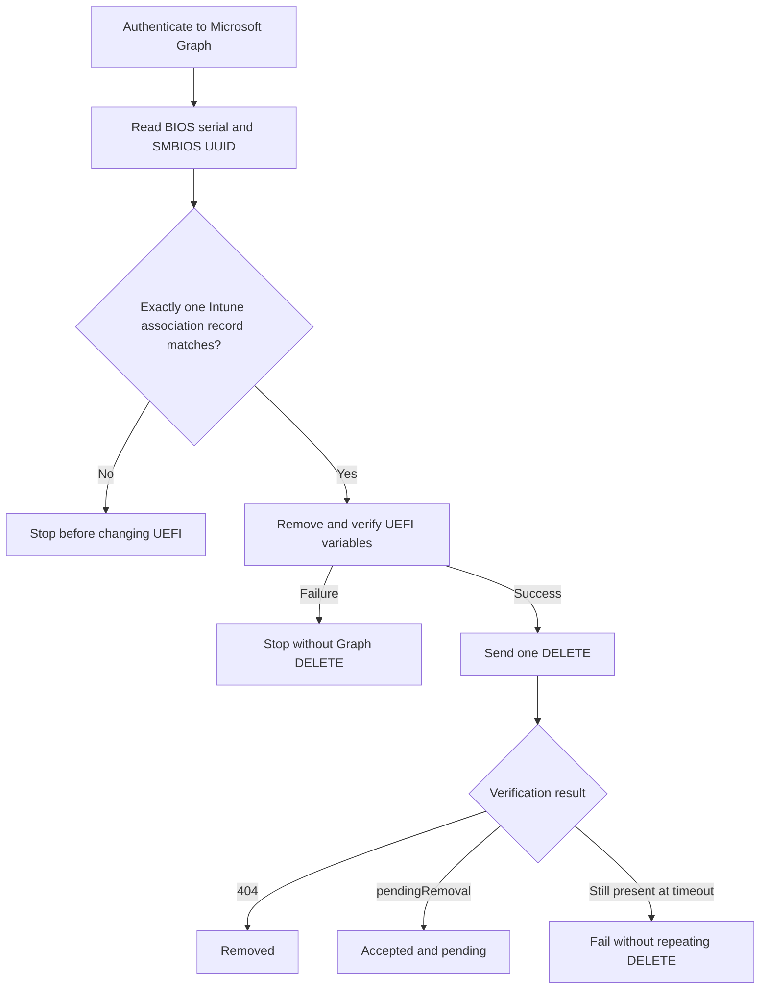

# Windows Autopilot Device Association toolkit

`Get-AutopilotDeviceAssociation.ps1` is a PowerShell toolkit for exporting, inspecting, importing, applying, reading and removing a Windows Autopilot Device Association.

**Current version: 1.7.0**

Short version for PowerShell Gallery visitors: [GALLERY.md](../GALLERY.md)

It brings the device-side and Intune-side parts of the lab workflow into one script. You can use it to export the genuine TPM-backed DeviceLink identity package produced by Windows, import that package into Intune, follow the association to the device, inspect its local UEFI markers and collect redacted evidence when something fails.

The technical background and complete 12-step flow are explained in the Patch My PC article:

**[Windows Autopilot Device Association: the complete 12-step flow](https://patchmypc.com/blog/windows-autopilot-device-association/)**

> [!IMPORTANT]
> This is a diagnostic and lab toolkit. It calls Windows DeviceLink interfaces and Microsoft Graph beta endpoints that can change. Test it before using it in an operational workflow. Removing an association changes UEFI state and, by default, also deletes the Intune Device Association record.

## Contents

- [What the script can do](#what-the-script-can-do)
- [How Device Association works](#how-device-association-works)
- [How this differs from Get-WindowsAutopilotInfo](#how-this-differs-from-get-windowsautopilotinfo)
- [Requirements](#requirements)
- [Download and preparation](#download-and-preparation)
- [Authentication and policy selection](#authentication-and-policy-selection)
- [Quick start](#quick-start)
- [Actions](#actions)
- [Parameters](#parameters)
- [Inspecting a DeviceLink CSV](#inspecting-a-devicelink-csv)
- [Reading and removing the UEFI association](#reading-and-removing-the-uefi-association)
- [Removing the Intune Device Association record](#removing-the-intune-device-association-record)
- [Logging and evidence](#logging-and-evidence)
- [Troubleshooting](#troubleshooting)
- [Security and behavior boundaries](#security-and-behavior-boundaries)
- [Validation](#validation)
- [Version history](#version-history)
- [References](#references)

## What the script can do

| Capability | What it does |
|---|---|
| Export | Asks the Windows DeviceLink API to create a genuine `*.devicelink.csv` containing the device's TPM-backed identity package. |
| Inspect | Decodes the CSV and reports device inventory. |
| Upload | Sends the unchanged CSV `Data` value and selected Device Preparation policy to Intune through Microsoft Graph. |
| Wait | Polls the imported record until it reaches `preassociated` or `associated`. |
| Discover | Asks the native Windows DeviceLink manager to discover the tenant's enrollment service. |
| Link | Runs native discovery and asks Windows to obtain and apply the tenant-signed DeviceLink association. |
| Read association | Reports the presence, length, attributes and SHA-256 of known Device Link UEFI variables without returning their contents. |
| Remove local association | Deletes and verifies the known Device Link UEFI variables. |
| Remove cloud association | Optionally resolves and deletes the matching Intune Device Association record after local UEFI removal succeeds. |
| Diagnose | Creates numbered steps, safe verbose events and one redacted diagnostic artifact for every REST request. |


## How Device Association works

Device Association gives Windows a trusted tenant relationship before a user signs in. That relationship can then be used to request current OOBE settings for the device. Association, policy retrieval, Entra join and Intune enrollment are separate operations.

```mermaid
flowchart LR
    A[Windows in OOBE] -->|Export genuine identity| B[DeviceLink CSV]
    B -->|Import unchanged Data value| C[Intune Device Association]
    C -->|Pre-associated| D[Windows discovery]
    D --> E[TPM and attestation]
    E --> F[Tenant-signed DeviceLink]
    F -->|Store locally| G[UEFI association]
    G --> H[Tenant-aware OOBE policy request]
    H --> I[User sign-in, Entra join and Intune enrollment]
```



The script covers the export, inspection, import, wait, discovery, association and local evidence shown above. It does not replace the OOBE UI and does not enroll the computer by itself.

The native `Link` operation can include traffic for discovery, TPM or Azure Attestation, DeviceLink download and acknowledgement. That traffic belongs to Windows, not PowerShell, so it is outside the script's REST logger.

## How this differs from Get-WindowsAutopilotInfo

Microsoft's `Get-WindowsAutopilotInfo` script collects the classic Windows Autopilot hardware hash and can upload it as an Autopilot registration. `Get-AutopilotDeviceAssociation.ps1` asks Windows for a different artifact: a signed DeviceLink identity package used to create an Intune Device Association record. The CSV schemas, service endpoints and resulting device records are therefore not interchangeable.

This toolkit does adopt the useful operational pattern from `Get-WindowsAutopilotInfo -Online`: submitting the record is only the beginning, so the script polls the returned record and reports the service state. `Upload`, `Sync` and `Full` now terminate with an error unless the record reaches `preassociated` or `associated` before `-TimeoutSec`. A successful POST without a returned record ID is also treated as unverified rather than successful.

Options such as group tag, assigned user, assigned computer name, adding a device to an Entra group, remote WMI collection, a multi-device append file and automatic reboot belong to classic hardware-hash registration. Device Association is bound to the local TPM-backed DeviceLink export and selects a Device Preparation policy during import, so those options were deliberately not copied. The toolkit also does not install Graph modules at runtime: its direct REST path keeps the HTTP evidence and zero automatic retry behavior under the script's control.

## Requirements

The exact requirements can change as Microsoft updates Device Association. Check Microsoft's current documentation before testing.

Microsoft's documented requirements for Device Association ([reference](https://learn.microsoft.com/autopilot/device-preparation/device-association/requirements)):

- A **physical device**. Virtual machines are not supported.
- **Windows 11 24H2** (`26100.9278`) or **25H2** (`26200.9278`) with **KB5120998** or later.
- A supported edition: Pro, Pro Education, Pro for Workstations, Enterprise, Education, or Enterprise LTSC.
- **TPM 2.0**, enabled and in a good state, not in Reduced Functionality Mode. TPM attestation is enforced during association.
- UEFI firmware, since the association is stored in a UEFI variable.
- HTTPS to `ztd.dds.microsoft.com` and the `peapdamaa*.attest.azure.net` endpoints, on top of the baseline device-preparation networking requirements.
- An Intune tenant with a Device Preparation policy, and suitable Intune RBAC.
- An elevated 64-bit PowerShell session, or a SYSTEM context where appropriate.

Run `-Action CheckRequirements` to verify most of these against the local machine before you start:

```powershell
.\Get-AutopilotDeviceAssociation.ps1 -Action CheckRequirements -Online
```

> [!NOTE]
> When Microsoft documents a newer Windows 11 release for Device Association, add it to the `$DL_REQ_BUILDS` table near the top of the requirements section in the script:
>
> ```powershell
> $DL_REQ_BUILDS = @{
>     '24H2' = @{ Build = 26100; MinUbr = 9278 }
>     '25H2' = @{ Build = 26200; MinUbr = 9278 }
>     '26H2' = @{ Build = 26300; MinUbr = 1234 }   # add new releases here
> }
> ```
>
> Until then a newer build is reported as a **warning, not a failure** - it already supersedes KB5120998, so the script treats it as untested rather than unsupported and does not disqualify the device.

The script has been parsed and tested with Windows PowerShell 5.1 and PowerShell 7.6. The tests use local Graph and firmware substitutes; they do not prove that every Windows build or tenant exposes the same beta behavior.


`Inspect` can run without elevation or Graph access. `ReadAssociation` and local removal need access to UEFI variables and therefore must run elevated. Export and native association are intended for the supported Windows OOBE scenario.

## Download and preparation

Place [`Get-AutopilotDeviceAssociation.ps1`](./Get-AutopilotDeviceAssociation.ps1) in a working folder on the test device. If Windows marked the downloaded file as coming from the internet, review it and unblock it:

```powershell
Unblock-File -Path .\Get-AutopilotDeviceAssociation.ps1
```

Open an elevated PowerShell session and view the built-in help:

```powershell
Get-Help .\Get-AutopilotDeviceAssociation.ps1 -Detailed
```

By default, exported files are written below:

```text
C:\ProgramData\DeviceLink
```

Each run writes its diagnostic files to a separate subdirectory below:

```text
C:\ProgramData\DeviceLink\Logs
```

Use `-WorkFolder` and `-LogFolder` to change those locations.

## Authentication and policy selection

The toolkit supports interactive user sign-in and unattended application authentication. Interactive sign-in is the default for any Graph action when no secret or certificate is supplied. You do not have to enter a tenant ID, client ID or secret for that default path. Certificate authentication is the better choice for an unattended task. Client-secret authentication remains available, but it can expose the secret through command history or process inspection.

### Default interactive device-code sign-in

The shortest upload command is:

```powershell
.\Get-AutopilotDeviceAssociation.ps1 -Online `
  -CsvPath 'C:\Temp\PC1.devicelink.csv' `
  -DevicePreparationPolicyId '<policy-guid>'
```

When used without `-Action`, `-Online` is shorthand for `-Action Upload`. Because no app-only credential is present, the script uses Microsoft's **Microsoft Graph Command Line Tools** public client, the same first-party client used by Microsoft Graph PowerShell, and starts device-code sign-in against the `organizations` authority. The public client ID is `14d82eec-204b-4c2f-b7e8-296a70dab67e`; it is an application identifier, not a secret. The work account selected during sign-in determines the tenant.

When `-Action` is supplied, that explicit action takes precedence and `-Online` does not block it. This keeps the familiar online switch while allowing `Full`, `Sync`, `Link`, discovery, inspection, or removal to run normally. `-Online` does not turn local removal into cloud deletion; `-DeleteCloudAssociation` remains required for that destructive operation.

The script requests a device code from Microsoft, displays Microsoft's sign-in URL and one-time code once, and waits while you sign in. Without `-Verbose`, timestamped authentication events and polling details remain hidden so the authorization code is easy to find. The resulting delegated access token is held only in this PowerShell process and reused for the Graph calls in that run. The script does not request `offline_access`, receive a refresh token, or save the access token, device code or user code to its diagnostic logs. The one-time code must appear on the console, so an external transcript or screen recording can still capture it.

The tenant must allow the Microsoft Graph Command Line Tools enterprise application and grant the requested delegated permissions. If user consent is restricted, an administrator must consent. The signed-in account also needs enough Intune RBAC access to read policies, import Device Association records, or delete them, depending on the selected action.

| Delegated permission | Used by the toolkit for |
|---|---|
| `DeviceManagementConfiguration.Read.All` | Reading available Device Preparation policies. |
| `DeviceManagementConfiguration.ReadWrite.All` | The working lab's delegated read/write access to device-configuration operations. |
| `DeviceManagementServiceConfig.Read.All` | Reading Device Association records and their state. |
| `DeviceManagementServiceConfig.ReadWrite.All` | Importing and deleting Device Association records. |

The four similarly named **Application permissions** used by app-only authentication do not authorize delegated sign-in. The default interactive client needs the delegated versions. If your tenant blocks the Microsoft first-party command-line client, use the custom interactive option below.

### Optional custom interactive app

To use your own public-client app registration, supply its tenant and client IDs. `-InteractiveLogin` remains accepted for clarity and backward compatibility, but interactive mode is already selected whenever no secret or certificate is present:

```powershell
-TenantId '<tenant-guid>' `
-ClientId '<application-guid>' `
-InteractiveLogin
```

For this custom app, enable **Allow public client flows**, add the four delegated permissions above, grant the required consent, and use an account with suitable Intune RBAC permissions. A custom client ID without a tenant ID is rejected so the script cannot silently authenticate against the wrong authority.

### Unattended application authentication

App-only Graph actions can use a certificate or client secret. Certificate authentication avoids placing a client secret in the command line and PowerShell history.

The certificate must be available with its private key in either:

```text
Cert:\CurrentUser\My
Cert:\LocalMachine\My
```

Example certificate parameters:

```powershell
-TenantId '<tenant-guid>' `
-ClientId '<application-guid>' `
-CertificateThumbprint '<certificate-thumbprint>'
```

Client-secret authentication is also supported:

```powershell
-TenantId '<tenant-guid>' `
-ClientId '<application-guid>' `
-ClientSecret '<client-secret>'
```

> [!CAUTION]
> Redaction protects the script's diagnostic files, but it cannot remove a secret from your interactive command history, process inspection tools or external transcripts. Prefer a certificate and never commit secrets to a repository.

### Microsoft Graph application permissions

The app registration used for the working lab had these **Microsoft Graph application permissions**:

| Application permission | Used by the toolkit for |
|---|---|
| `DeviceManagementConfiguration.Read.All` | Reading the available Device Preparation policies when the script needs to resolve a policy. |
| `DeviceManagementConfiguration.ReadWrite.All` | The working lab's read/write access to Intune device-configuration operations. |
| `DeviceManagementServiceConfig.Read.All` | Reading Device Association records and their state. |
| `DeviceManagementServiceConfig.ReadWrite.All` | Importing and deleting Device Association records. |

Add them under **App registrations > API permissions > Add a permission > Microsoft Graph > Application permissions**, then select **Grant admin consent** for the tenant. These grants are used only by the certificate and client-secret flows. Interactive login uses the delegated versions documented above.

> [!NOTE]
> This is the permission set confirmed in the lab, rather than a claim that all four grants form the least-privileged set. The corresponding `ReadWrite.All` permissions normally overlap read access, but the beta `tenantAssociatedDevices` and `importTenantAssociatedDevice` operations do not currently have a public Microsoft Graph permission table that lets us prove a smaller combination. Test reduced permissions separately before relying on them.

When an import needs a Device Preparation policy, use one of these selection methods:

| Parameter | Selection behavior |
|---|---|
| `-DevicePreparationPolicyId` | Uses the supplied policy ID directly. This is the most deterministic option. |
| `-PolicyName` | Lists applicable policies and selects an exact name match. |
| No policy parameter | Uses the first applicable policy returned by Graph. This is the default. |
| `-FirstPolicy` | Explicitly requests the same first-policy behavior. Retained for compatibility. |

If the tenant has no applicable Device Preparation policy, the script stops before import. If `-PolicyName` does not match, it reports the available policy names and stops. Supply an exact policy ID when deterministic selection matters in a tenant with multiple policies.

## Quick start

### Inspect an existing CSV without changing it

```powershell
.\Get-AutopilotDeviceAssociation.ps1 -Action Inspect `
  -CsvPath 'C:\Temp\PC1.devicelink.csv' `
  -Verbose
```

### Export a genuine DeviceLink CSV

Run this in the supported Windows/OOBE context:

```powershell
.\Get-AutopilotDeviceAssociation.ps1 -Action Export -Verbose
```

The script prints the complete path of the exported CSV.

### Upload an existing CSV

```powershell
.\Get-AutopilotDeviceAssociation.ps1 -Online `
  -CsvPath 'C:\Temp\PC1.devicelink.csv' `
  -Verbose
```

PowerShell displays Microsoft's device-login instructions. Open the shown URL, enter the one-time code and sign in with the authorized Intune administrator account. No tenant ID, app ID, secret, or policy parameter is required for this default path. The first applicable Device Preparation policy returned by Graph is selected. For unattended execution, use `-TenantId`, `-ClientId` and `-CertificateThumbprint`.

Upload has no automatic POST retry. If the service response is uncertain, review the HTTP diagnostic artifact and Intune before sending the import again.

After Graph accepts the POST, the script requires a returned association-record ID and polls that exact record. The action succeeds only after the state becomes `preassociated` or `associated`; a timeout is a terminating failure and includes the last state returned by the service.

### Export and upload, but do not apply the association locally

```powershell
.\Get-AutopilotDeviceAssociation.ps1 -Action Sync `
  -DevicePreparationPolicyId '<policy-guid>' `
  -Verbose
```

`Sync` exports the CSV, uploads it and waits for the Intune record to become pre-associated. It does not run the native local association step.

### Run the complete lab pipeline

```powershell
.\Get-AutopilotDeviceAssociation.ps1 -Online -Action Full `
  -DevicePreparationPolicyId '<policy-guid>' `
  -Verbose
```

`Full` performs export, inspection, import, waits for pre-association, then invokes native Windows discovery and association.

### Discover without applying the association

```powershell
.\Get-AutopilotDeviceAssociation.ps1 -Action Discover `
  -CsvPath 'C:\Temp\PC1.devicelink.csv' `
  -Verbose
```

### Discover and apply the association

```powershell
.\Get-AutopilotDeviceAssociation.ps1 -Action Link `
  -CsvPath 'C:\Temp\PC1.devicelink.csv' `
  -Verbose
```

### Check whether this device qualifies

```powershell
.\Get-AutopilotDeviceAssociation.ps1 -Action CheckRequirements

# add -Online to also test the required Microsoft endpoints
.\Get-AutopilotDeviceAssociation.ps1 -Action CheckRequirements -Online
```

### Read the local UEFI markers

```powershell
.\Get-AutopilotDeviceAssociation.ps1 -Action ReadAssociation -Verbose
```

### Check whether the association token is valid

```powershell
# offline: structure, iat/exp window, linkId, tenant and device-binding claims
.\Get-AutopilotDeviceAssociation.ps1 -Action ReadAssociation -Validate -TenantId '<tenant-guid>' -Verbose

# online: the above plus RS256 signature verification against the issuer's published key
.\Get-AutopilotDeviceAssociation.ps1 -Action ReadAssociation -Validate -Online -TenantId '<tenant-guid>' -Verbose
```

### Preview local removal

```powershell
.\Get-AutopilotDeviceAssociation.ps1 -Action RemoveAssociation -WhatIf -Verbose
```

### Remove only the local UEFI association (keep the Intune record)

```powershell
.\Get-AutopilotDeviceAssociation.ps1 -Action RemoveAssociation -Verbose
```

### Preview local and Intune Device Association removal

The online `-WhatIf` run performs authentication and the read-only cloud lookup, but it does not change UEFI or send DELETE:

```powershell
.\Get-AutopilotDeviceAssociation.ps1 -Action RemoveAssociation `
  -Online `
  -WhatIf -Verbose
```

### Remove the local and Intune Device Association

```powershell
.\Get-AutopilotDeviceAssociation.ps1 -Action RemoveAssociation `
  -Online `
  -Verbose
```

## Actions

Every action prints its plan before starting and reports progress as `[STEP current/total]`.

| Action | Steps | Network | Changes state |
|---|---:|---|---|
| `CheckRequirements` | 1 | No (or endpoint tests with `-Online`) | No; verifies the documented Device Association requirements. |
| `Inspect` | 1 | No | No; reads and decodes the selected CSV. |
| `Export` | 2 | Native Windows behavior | Creates a CSV, then inspects it. |
| `Upload` | 3 | Microsoft identity and Graph | Imports the supplied identity and polls its association state. |
| `Sync` | 4 | Native Windows behavior, Microsoft identity and Graph | Exports, imports and waits for pre-association. |
| `Discover` | 2 | Native Windows DeviceLink traffic | Requests tenant discovery without applying the association. |
| `Link` | 2 | Native Windows DeviceLink traffic | Discovers and applies the association. |
| `Full` | 5 | Native Windows behavior, Microsoft identity and Graph | Exports, imports, waits, discovers and applies. |
| `ReadAssociation` | 1 | No | No; reads metadata about known UEFI variables. |
| `ReadAssociation -Validate` | 2 | No (offline) | No; also decodes and checks the `DeviceLinkJwtCompressed` token. |
| `ReadAssociation -Validate -Online` | 2 | Issuer metadata / JWKS (anonymous) | No; adds RS256 signature verification of the token. |
| `RemoveAssociation` | 4 | Microsoft identity and Graph | Deletes the local UEFI variables **and** the matching Intune record. |
| `RemoveAssociation -KeepCloudAssociation` | 1 | No | Deletes and verifies only the known local UEFI variables. |


`Action` defaults to `Full`. For safety, choose the action explicitly in scripts and administrative procedures.

## Parameters

| Parameter | Purpose | Default |
|---|---|---|
| `-Action` | Selects `Full`, `Sync`, `Export`, `Inspect`, `Upload`, `Discover`, `Link`, `ReadAssociation`, `RemoveAssociation` or `CheckRequirements`. | `Full` |
| `-Online` | Uses `Upload` when `-Action` is omitted. If `-Action` is supplied, the explicit action takes precedence. | Disabled |
| `-Version` | Prints the toolkit version and exits without creating a work folder or log. | Disabled |
| `-CsvPath` | Path to an existing `*.devicelink.csv`. | Newest CSV in `WorkFolder` where supported by the action. |
| `-DeviceLinkBase64` | Supplies the CSV `Data` value directly. | None |
| `-WorkFolder` | Stores exports and supplies the default CSV search location. | `C:\ProgramData\DeviceLink` |
| `-Format` | Windows DeviceLink export format flags. `33` means JSON plus Base64. | `33` |
| `-TimeoutSec` | Native-operation and polling timeout. | `300` seconds |
| `-HttpTimeoutSec` | Timeout for each PowerShell REST request. | `180` seconds |
| `-LogFolder` | Parent folder for per-run diagnostic folders. | `<WorkFolder>\Logs` |
| `-TenantId` | Optional tenant authority for custom delegated sign-in; required for app-only authentication. | `organizations` for default interactive sign-in |
| `-ClientId` | Optional custom public-client app ID; required for app-only authentication. This identifies an app and is not a secret. | Microsoft Graph Command Line Tools public client for interactive sign-in |
| `-ClientSecret` | Application secret for unattended app-only authentication. Prefer a certificate for unattended use. | None |
| `-CertificateThumbprint` | Thumbprint of a certificate with an accessible private key. | None |
| `-InteractiveLogin` | Explicitly selects the device-code path. Retained for compatibility; Graph actions already use it when no secret or certificate is supplied. | Automatic when Graph is needed and no app-only credential is supplied |
| `-DevicePreparationPolicyId` | Exact Device Preparation policy ID for import. | First returned applicable policy when neither ID nor name is supplied |
| `-PolicyName` | Exact Device Preparation policy name to resolve. | None |
| `-FirstPolicy` | Explicitly selects the first applicable policy returned by Graph. Retained for compatibility because this is now the default. | Disabled |
| `-KeepCloudAssociation` | With `RemoveAssociation`: clear the local UEFI variables only and leave the Intune record in place. Alias `-LocalOnly`. | Disabled (the record is removed) |
| `-DeleteCloudAssociation` | Retained for compatibility. Cloud removal is now the default, so this switch changes nothing. | Disabled |
| `-TenantAssociatedDeviceId` | Optional exact Device Association record GUID. The record must still match the local serial number or SMBIOS UUID. | Automatic matching |
| `-Force` | Continue even when the requirements preflight reports that the device does not qualify. Without it, an interactive session is asked to confirm and a non-interactive session stops. | Disabled |
| `-Validate` | With `ReadAssociation`: decode `DeviceLinkJwtCompressed` and check it is a well-formed RS256 JWT, inside its `iat`/`exp` window, with a `linkId` matching the `DeviceLinkId` UEFI variable and (with `-TenantId`) a matching tenant and device inventory. Add `-Online` to also verify the RS256 signature against the issuer's published key. Reports booleans, timestamps and the signing-key thumbprint only. | Disabled |
| `-ShowClaims` | With `-Validate`: also print the decoded JOSE header and full payload claims to the console. Console only; the claim values are never written to the diagnostic files. | Disabled |
| `-GraphBase` | Microsoft Graph base URL. Mainly useful for testing. | `https://graph.microsoft.com/beta` |
| `-Verbose` | Adds timestamped diagnostic events, policy-selection details, polling states, HTTP progress and technical result fields to the console. | Disabled |
| `-WhatIf` | Previews guarded removal operations. Online preview still performs authentication and read-only matching. | Disabled |

## Inspecting a DeviceLink CSV

The CSV contains a Base64-encoded JSON identity package. It includes device inventory, the DeviceLink identifier, public-key information and a signature produced with the device's TPM-backed identity key.

`Inspect` performs these checks without changing the file:

1. Detects common UTF-8 and UTF-16 encodings.
2. Requires one CSV row with a nonempty `Data` field.
3. Decodes the Base64 value into JSON.
4. Locates the public key named by `DeviceInfoSigningKeyName`.

Example output:

```text
SigningKey              : IDK_1
Algorithm               : RSA2048-SHA256
PssTrailer_0xBC         : True
SaltLength_claimed      : 222
SaltLength_inSignature  : 222
FieldMatchesSignature   : True
ValidationScope         : Salt structure only; the inventory message digest has not been verified.
```

The console intentionally displays selected identifiers such as serial number, SMBIOS UUID and Link ID. The saved diagnostic files redact those values. Consider screen sharing and console capture separately from file logging.

## Reading and removing the UEFI association

The script checks the union of Device Link variable names seen in the lab and described in Microsoft's removal guidance:

```text
Namespace: {B3DE75DA-819C-4FD5-9F01-C3D49E8CBBD7}

DeviceLinkJwtCompressed
DeviceLinkJwtLastWrite
DeviceLinkId
DeviceLinkBlob
DeviceLinkUtc
```

`ReadAssociation` reports only:

- Whether the variable is present, absent or unreadable.
- Its byte count.
- Its attributes.
- Its SHA-256 hash.
- The Win32 result.

The raw UEFI contents are never returned by this action or written to its logs.

### Validating the association token

`ReadAssociation -Validate` adds a second step that decodes `DeviceLinkJwtCompressed` and reports whether the association token is still valid. It decompresses the value (raw / DEFLATE / GZip), splits the JWT and checks:

| Check | Offline | Needs `-Online` |
|---|---|---|
| Decompresses to a 3-part `RS256` JWT | yes | |
| Inside its `iat` / `nbf` / `exp` window (300 s skew); reports days remaining | yes | |
| `linkId` claim equals the `DeviceLinkId` UEFI variable | yes | |
| `tenantId` claim equals `-TenantId` | yes (when `-TenantId` supplied) | |
| `deviceSerialNumber` / `deviceManufacturer` / `deviceModel` claims equal local WMI | yes | |
| Issuer host is a Microsoft domain | yes | |
| **RS256 signature verifies against the issuer's published key** | | **yes** |

With `-Online` the script resolves the signing key from the issuer's OpenID metadata / JWKS (an anonymous request; no Graph token) and verifies the signature. The output is a `Verdict` of `VALID`, `VALID (signature not checked)` (offline), `INDETERMINATE (signature not verified)` (online but keys not located) or `INVALID` with the failed checks listed. Only booleans, timestamps and the signing-key thumbprint are printed or logged; the token and the claim values are not.

Add `-ShowClaims` to also print the decoded JOSE header and the full payload to the **console** (never to the diagnostic files), the way `Inspect` shows selected CSV identifiers on screen:

```powershell
.\Get-AutopilotDeviceAssociation.ps1 -Action ReadAssociation -Validate -ShowClaims
```

Local removal follows a guarded sequence:

1. Read every known variable before deleting anything.
2. Stop without mutation if any variable cannot be read safely.
3. Delete only variables that are present.
4. Read every deleted variable again.
5. Fail the action if a variable is still present or deletion returned an error.

Deletion uses `SetFirmwareEnvironmentVariableW` with a null value and size zero. The script temporarily enables `SeSystemEnvironmentPrivilege` and restores the prior privilege state afterward.

Local removal does not clear the TPM, unenroll the device, delete the Intune managed-device object, delete the Entra device or remove a Device Preparation policy.

## Removing the Intune Device Association record

`RemoveAssociation` removes the Intune Device Association record as well as the local UEFI variables. Add `-KeepCloudAssociation` (alias `-LocalOnly`) to clear UEFI only. `-DeleteCloudAssociation` is still accepted and now describes the default.



Automatic matching queries Device Association records using the local BIOS serial number, then verifies exact serial-number or SMBIOS-UUID equality on the client. If more than one record matches, the script stops before UEFI removal.

You can supply an exact record ID when automatic lookup is ambiguous:

```powershell
.\Get-AutopilotDeviceAssociation.ps1 -Action RemoveAssociation `
  -TenantAssociatedDeviceId '<device-association-record-guid>' `
  -Verbose
```

Supplying the GUID is not a bypass. The returned record must still match the computer's serial number or SMBIOS UUID.

After UEFI verification succeeds, the script sends one direct request:

```http
DELETE /beta/deviceManagement/tenantAssociatedDevices/{record-id}
```

It does not use an automatic retry for DELETE. It then reads the same record until Graph returns `404`, which is recorded as `Removed`, or the association state becomes `pendingRemoval`. A `404` during this verification is expected and is logged as a successful result rather than an HTTP error.

The endpoint was confirmed in the supplied Intune portal HAR. The portal used the same DELETE inside a Graph batch and received a nested `204`, then refreshed the Device Association collection. The script uses a direct DELETE to make the single mutation easier to see in its diagnostic log.

> [!WARNING]
> The preflight proves that the app can authenticate and read the matching record. It cannot prove that the app also has permission to delete it without attempting the mutation. Graph can therefore reject DELETE after UEFI removal if the application has read access but lacks the required write access.

If the association record contains a `managedDeviceId`, the script warns that the computer is still enrolled. Removing the Device Association record does not remove that managed device. If the device remains MDM-enrolled, its provider can attempt to associate it again.

## Logging and evidence

Without `-Verbose`, the console shows the action plan, current step, selected policy name, Microsoft device-login message, high-level waiting status and final result. Informational event names, timestamps, HTTP progress, polling states and full returned records remain off the console. Errors are reduced to one final readable message where the action terminates.

`-Verbose` adds those diagnostic details to the console. The diagnostic files are still created without `-Verbose`, so the normal output can remain readable without losing support evidence.

Each execution creates a new directory named with the UTC timestamp, action and run ID. A run directory contains:

| File | Contents |
|---|---|
| `DeviceLink.log` | Readable chronological events and safe structured details. |
| `events.jsonl` | One JSON event per line for filtering and support analysis. |
| `http-NNN-Operation-status.json` | Redacted request and response details for each REST call made by the script. |

With `-Verbose`, the saved evidence includes:

- The selected input source and action plan.
- Step start, completion, elapsed time and failure context.
- File encoding, size and SHA-256.
- Authentication method without credentials.
- Policy-selection decisions.
- HTTP method, redacted URI, timeout and header names.
- Request-body size and SHA-256 for non-authentication calls.
- Service and client request IDs where returned.
- Response status, headers and a redacted or truncated body.
- Polling attempts and final association state.
- Validation that the import returned a record ID, with only its SHA-256 retained in the log.
- UEFI variable status, attributes, size, SHA-256 and Win32 result.

The script suppresses the built-in verbose and debug streams of `Invoke-RestMethod`, even when the main script uses `-Verbose`. Those web-command streams can expose headers or bodies.

The logger redacts or omits access tokens, client secrets, OAuth device and user codes, authentication bodies, DeviceLink payloads, raw UEFI contents, signatures, public-key blobs, tenant IDs and device identifiers. Interactive authentication requests no refresh token. Redaction reduces disclosure risk; it is not a guarantee that an unexpected service message can never contain sensitive tenant data. Review diagnostic files before sharing them.

The HTTP artifacts cover only requests made by this PowerShell process. They do not capture Windows' native DeviceLink traffic.

## Troubleshooting

### The upload returns HTTP 500

Run `Inspect` against the exact failing file and retain:

- The CSV SHA-256.
- Decoded JSON SHA-256.
- Declared and recovered PSS salt lengths.
- `FieldMatchesSignature` result.
- HTTP status.
- Graph `request-id` and `client-request-id`.
- The redacted response body from the HTTP artifact.


### Graph authentication fails

Check that:

- For default interactive sign-in, the tenant permits the **Microsoft Graph Command Line Tools** enterprise application and the requested delegated permissions have consent.
- The signed-in account has the Intune RBAC access required for the requested action.
- For a custom interactive app, the tenant ID and client ID are correct, **Allow public client flows** is enabled, and the four delegated Graph permissions are configured and consented.
- For certificate authentication, the certificate exists in `CurrentUser\My` or `LocalMachine\My`, has an accessible private key and is not expired.
- For certificate or client-secret authentication, the four application permissions are configured and have administrator consent.
- The device can reach Microsoft identity and Graph endpoints.

The script saves a redacted authentication HTTP record without storing the token, device-login codes or authentication body. If the default Microsoft client is blocked by tenant policy, use a custom public-client app or an app-only certificate. If a custom device-code client is rejected, verify that app registration's public-client setting. If authentication succeeds but Graph returns `403`, review both Graph consent and the signed-in user's Intune role.

### Graph can read but cannot delete

A successful lookup does not prove write authorization. Review the DELETE HTTP artifact for `401` or `403`, confirm the application permissions and administrator consent, and remember that the local UEFI removal has already succeeded if the failure occurred in Step 3 of the four-step online removal plan.

### The upload POST succeeds but the action still fails

The POST response is not the final Device Association result. The script must receive a record ID and then observe `preassociated` or `associated`. If the service never returns an ID, or the record remains in another state until `-TimeoutSec`, the action stops as unverified. Review the numbered polling HTTP artifacts and the `AssociationState` events for the last service response before deciding whether a new import is safe.

### More than one association record matches

Automatic deletion stops before changing UEFI. Find the correct Device Association record in Intune and rerun with `-TenantAssociatedDeviceId`. The exact record still has to match the computer locally.

### UEFI read fails

Run a fresh 64-bit elevated PowerShell session. Confirm that the device uses UEFI and that the process can enable `SeSystemEnvironmentPrivilege`. The script will not delete any variable if the initial read of the known set is incomplete.

### UEFI deletion returns Win32 error 87

An earlier build used the five-parameter `SetFirmwareEnvironmentVariableExW` deletion path with an attribute value of zero. The corrected build uses `SetFirmwareEnvironmentVariableW` with a null, zero-size value. Close the PowerShell process that loaded the older interop type, open a new elevated session and use the current script.

### Reading works but privilege restoration fails

An earlier build passed an invalid zero-length output-buffer combination while restoring the token privilege. The current interop restores the previously captured privilege state without requesting another output copy. Close the older PowerShell session before retesting.

### Native association reports an HRESULT of zero but no success

An HRESULT of zero does not by itself establish that association succeeded. The script treats `SuccessfullyAppliedLink` as the successful client result and records other results as unconfirmed or failed.

### The device associates again after removal

Deleting the UEFI markers and Device Association record does not unenroll the computer. An active MDM provider can attempt association again. Follow the proper tenant offboarding order when permanent removal is the goal.

### The device is associated but OOBE settings do not appear

Association supplies the trusted tenant context. Current OOBE policy still has to be downloaded over the network and consumed at the correct point in setup. Diagnose DNS, connectivity, service response and policy assignment separately from the association state.

## Security and behavior boundaries

The following boundaries are deliberate:

- The script exports through Windows; it does not fabricate DeviceLink identities.
- The CSV `Data` value is uploaded unchanged.
- `Inspect` does not claim full signature validation.
- HTTP mutations have zero automatic retries.
- Interactive sign-in uses the OAuth device authorization grant, keeps the access token in memory and does not request a refresh token.
- Graph actions select interactive sign-in automatically when no client secret or certificate is supplied.
- `-InteractiveLogin` is retained for compatibility and cannot be combined with a client secret or certificate.
- Cloud deletion requires an explicit switch and occurs only after verified local removal.
- Automatic cloud matching must resolve to exactly one record.
- An explicit cloud record ID must still match the local computer.
- `WhatIf` prevents UEFI and Graph mutations.
- Raw UEFI association contents are not returned or logged.
- The TPM is not cleared or modified by removal.
- Intune managed-device and Entra device objects are not deleted.
- Native Windows HTTP traffic is not intercepted.
- The QR-code enrollment route is not implemented by this script.
- The Graph base defaults to `beta`; beta contracts can change.

The script uses `SupportsShouldProcess`. Local removal and Graph deletion therefore honor PowerShell's `-WhatIf` and `-Confirm` behavior.

## Validation

The packaged build has been checked with Windows PowerShell 5.1 and PowerShell 7.6 for:

- PowerShell parsing.
- Native firmware interop compilation without invoking real firmware APIs.
- Read-before-delete and post-delete verification through a firmware substitute.
- Blocking all local deletes when one initial firmware read fails.
- Correct privilege restoration and zero-size UEFI deletion patterns.
- Exact cloud identity matching.
- Blocking ambiguous and mismatched cloud records.
- One DELETE with no POST or batch fallback.
- Verification after DELETE and expected `404` handling.
- Redaction of tokens, serial number, SMBIOS UUID and Graph record IDs.
- Numbered action plans and verbose gating.
- HTTP success, JSON failure, HTML failure, transport failure and no-retry behavior.
- Interactive device-code prompting, delegated scope selection, pending authorization polling, in-memory token reuse and code/token redaction.
- Delegated scope auditing when Microsoft includes granted-scope metadata in the token response.
- Import record-ID validation, record-ID redaction and terminating pre-association timeouts.
- Read-only inspection of a real CSV without modifying its bytes.
- Offline `RemoveAssociation -WhatIf` without firmware reads or writes.
- `ReadAssociation -Validate` token decode, `iat`/`exp` lifetime maths, `linkId`/claim binding and RS256 signature verification against a substitute key, with the token and claim values redacted.

No real Graph mutation, UEFI deletion, TPM change, Intune deletion or Entra deletion was performed by the automated validation. See [`Verification.json`](./Verification.json) and [`manifest.json`](./manifest.json) for the packaged evidence and hashes.

The package also contains exact pre-change script snapshots for comparison and rollback.

## Version history

### 1.7.0

- `RemoveAssociation` now removes the **Intune Device Association record as well as the local UEFI variables by default**. Previously the cloud record was left behind unless `-DeleteCloudAssociation` was supplied.
- Added `-KeepCloudAssociation` (alias `-LocalOnly`) to clear UEFI only.
- `-DeleteCloudAssociation` is still accepted and now describes the default, so existing commands keep working. Supplying both switches is rejected.
- The safety rules are unchanged: the cloud record must match this computer exactly and uniquely, it is deleted only after local UEFI removal has been verified, one DELETE is sent, and `-WhatIf` still previews everything.
- Because cloud removal is now the default, `RemoveAssociation` signs in to Microsoft Graph unless `-KeepCloudAssociation` is used.

### 1.6.1

- Replaced the raw PowerShell exception shown when the preflight stops a run with a readable summary: what is not met, how to fix it, and the two commands to get the full report or override.
- A preflight stop is no longer recorded as a failed run, and exits with status 0.
- The unmet requirements now appear in the confirmation prompt itself rather than being printed twice.

### 1.6.0

- The requirements preflight now **asks before continuing**. `Export`, `Sync`, `Discover`, `Link` and `Full` list the unmet requirements and prompt; `-Force` skips the prompt, and a host that cannot prompt stops rather than proceeding into a confusing native error.
- Added `-Force`.
- Native DeviceLink HRESULTs carry a plain-language hint: `0x80004001` (E_NOTIMPL - the build predates KB5120998 and has no DeviceLink API), `0x8103C00F` (no attestation material), `0x80090029` / `0x80090016` (the TPM refused the association key), `0x80070005` (not elevated).

### 1.5.0

- Added `-Action CheckRequirements`, which verifies the [documented Device Association requirements](https://learn.microsoft.com/autopilot/device-preparation/device-association/requirements) against the local machine.
- Checks: physical device (virtual machines are not supported), 64-bit Windows 11 client, a supported build (24H2 `26100.9278` or 25H2 `26200.9278`, KB5120998 or later), a supported edition, TPM 2.0 enabled and not in Reduced Functionality Mode, UEFI firmware, Secure Boot, and whether the TPM has recently refused to create the `DEVICEASSOCIATION_TACK_RSA` key.
- `-Online` additionally tests TCP 443 to `ztd.dds.microsoft.com` and the thirteen `attest.azure.net` endpoints.
- A Windows build newer than the documented releases is reported as a warning, not a failure: it already supersedes KB5120998, so it is treated as untested rather than unsupported. New releases are added by editing the `$DL_REQ_BUILDS` table.
- Checks that need elevation report `Unknown` rather than a false failure, and the report says so.

### 1.4.0

- Added `-Action ReadAssociation -Validate`: decompresses `DeviceLinkJwtCompressed`, then checks the token is a well-formed RS256 JWT, inside its `iat`/`exp` window, with a `linkId` matching the `DeviceLinkId` UEFI variable and (with `-TenantId`) a matching tenant and device inventory.
- `-Validate -Online` resolves the issuer's published signing key from OpenID metadata / JWKS and verifies the RS256 signature. The lookup is anonymous; no Graph token is used.
- The validation step prints and logs only booleans, timestamps and the signing-key thumbprint. The token and claim values are added to the redaction set. `-ShowClaims` prints the decoded header and payload to the console only.
- No change to any other action.

### 1.3.0

- Renamed the script and the published command to `Get-AutopilotDeviceAssociation.ps1` / `Get-AutopilotDeviceAssociation`.
- Added a `.DESCRIPTION` block and extra tags so `Test-ScriptFileInfo` and `Publish-Script` accept the file for the PowerShell Gallery.
- Left every action, the console banner, the `C:\ProgramData\DeviceLink` work folder and the `DeviceLink.log` diagnostic file name unchanged.

### 1.2.0

- Kept normal console output focused on the action, sign-in code, selected policy and result.
- Moved timestamped events, HTTP progress, polling states and returned-record details behind `-Verbose`.
- Made the first returned Device Preparation policy the default when no policy ID or name is supplied.
- Kept `-FirstPolicy` as a compatibility switch.

### 1.1.1

- Made an explicit `-Action` take precedence when `-Online` is also present, including `Full`, `Sync`, `Link`, and removal.
- Kept cloud deletion behind the explicit `-DeleteCloudAssociation` safety switch.

### 1.1.0

- Made Microsoft device-code sign-in the default for Graph actions, with no tenant ID, client ID or secret required.
- Added `-Online` as a short form of `-Action Upload`.
- Kept custom delegated sign-in, certificate authentication and client-secret authentication.
- Added delegated-scope auditing and clearer authentication logging.
- Required the import to return a record ID and reach `preassociated` or `associated` before reporting success.
- Redacted raw association-record IDs while retaining their SHA-256 for correlation.

### 1.0.0

- Initial combined toolkit for DeviceLink export, inspection, upload, discovery, association, UEFI evidence and verified local or cloud removal.

## References

- [Windows Autopilot Device Association — Patch My PC](https://patchmypc.com/blog/windows-autopilot-device-association/)
- [Remove a device association — Microsoft Learn](https://learn.microsoft.com/en-us/autopilot/device-preparation/device-association/remove-association)
- [Overview of Windows Autopilot device association — Microsoft Learn](https://learn.microsoft.com/en-us/autopilot/device-preparation/device-association/overview)
- [Requirements for Windows Autopilot device association — Microsoft Learn](https://learn.microsoft.com/en-us/autopilot/device-preparation/device-association/requirements)
- [Windows Autopilot device preparation requirements — Microsoft Learn](https://learn.microsoft.com/en-us/autopilot/device-preparation/requirements)
- [Windows Autopilot device preparation policy — Microsoft Learn](https://learn.microsoft.com/en-us/autopilot/device-preparation/tutorial/user-driven/entra-join-autopilot-policy)
- [Microsoft Graph best practices](https://learn.microsoft.com/en-us/graph/best-practices-concept)
- [Microsoft Graph PowerShell authentication commands](https://learn.microsoft.com/en-us/powershell/microsoftgraph/authentication-commands?view=graph-powershell-1.0)
- [Microsoft identity platform OAuth 2.0 device authorization grant](https://learn.microsoft.com/en-us/entra/identity-platform/v2-oauth2-device-code)
- [Microsoft Graph permissions reference](https://learn.microsoft.com/en-us/graph/permissions-reference)
- [Get-WindowsAutopilotInfo 3.9 — PowerShell Gallery](https://www.powershellgallery.com/packages/Get-WindowsAutoPilotInfo/3.9)
- [Manually register devices with Windows Autopilot — Microsoft Learn](https://learn.microsoft.com/en-us/autopilot/add-devices)

## Disclaimer

Use the toolkit in a controlled environment and review every destructive operation. Windows, Intune and Microsoft Graph beta behavior can change. This repository documents observed Windows behavior and supplied lab evidence; it does not turn internal implementation details into a supported Microsoft API contract.
